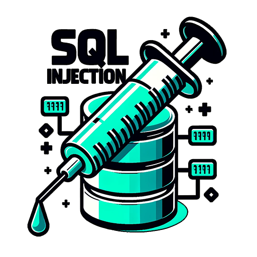

# Server Side Vulnerabilities

## SQL injection (SQLi)



SQL injection (SQLi) is a critical web security vulnerability that enables attackers to manipulate the database queries made by an application. This allows them to access unauthorized data, potentially compromising user privacy and application integrity. Attackers can also modify or delete data, leading to persistent changes in the application. In severe cases, SQLi can be used to compromise the server or launch denial-of-service attacks.

### Impact of SQL Injections:

1. **Data Manipulation**: Attackers can tamper with existing data, potentially altering, deleting, or inserting new records.

1. **Identity Spoofing**: Attackers can gain unauthorized access by pretending to be someone else, potentially leading to unauthorized transactions and actions.

1. **Data Disclosure**: Entire databases can be exposed, leading to theft of sensitive information like user details, financial records, personal messages, etc.

1. **Data Destruction**: Databases can be destroyed or rendered unavailable, disrupting business operations and causing financial losses.

1. **Admin Rights**: Attackers can potentially gain administrative rights to the database server, giving them unrestricted access and control.

### SQL Injection (SQLi) Example for Web Login

#### **Context:**

Imagine a website where users log in with their username and password. The website queries a database to verify these credentials.

#### **Normal Query:**

The application might use SQL like:

```sql
SELECT * FROM users WHERE username='INPUT_USERNAME' AND password='INPUT_PASSWORD';
```

Where `INPUT_USERNAME` and `INPUT_PASSWORD` are replaced by what the user enters.

#### **SQLi Attack:**

An attacker enters:

```vbnet
Username: admin' --
Password: [anything]
```

Resulting in the SQL:

```sql
SELECT * FROM users WHERE username='admin' --' AND password='[anything]';
```

The `--` is a comment out symbol in SQL. The rest of the query is ignored, authenticating as 'admin' without needing the password!

#### **Consequences:**

1. Unauthorized Access: Attacker logs in as an admin without knowing the password.
1. Potential Data Breach: The attacker can exploit further vulnerabilities.

#### **Explanation:**

The application directly uses user input in SQL, allowing query manipulation.

#### **Prevention:**

- Use parameterized queries or prepared statements.
- Avoid directly adding user input into SQL queries.
- Utilize web application firewalls and security audits.

> **For more Examples see:** https://portswigger.net/web-security/sql-injection#sql-injection-examples

# Resources

1. https://portswigger.net/web-security/sql-injection
1. https://owasp.org/www-community/attacks/SQL_Injection
1. https://book.hacktricks.xyz/pentesting-web/sql-injection
